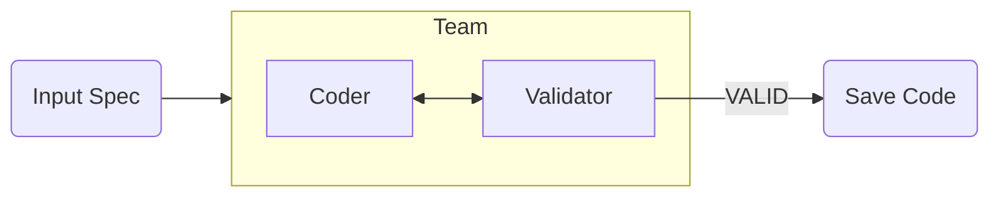

# 🍳 Mini ChefGenie: Tim Robot yang Bekerja Sama!

Halo! Ini adalah proyek tentang **Tim Robot Koki** yang bisa ngobrol satu sama lain untuk membuat kode komputer yang sempurna.

---

## 👶 Penjelasan Sederhana (Untuk Anak SD)

Dulu, robot kita bekerja sendirian. Sekarang, mereka bekerja dalam **satu tim**!

1.  **Robot Penulis (SpecAwareCoder)**: Tugasnya menulis kode.
2.  **Robot Pemeriksa (SpecValidator)**: Tugasnya mengecek kode.

**Gimana cara kerja tim ini?**
- Robot Penulis menulis kode pertama.
- Robot Pemeriksa melihatnya. Kalau ada yang salah, dia bilang: *"Eh, kodenya kurang teliti nih, perbaiki ya!"*
- Robot Penulis mendengarkan, lalu memperbaikinya.
- Mereka terus ngobrol sampai Robot Pemeriksa bilang: **"VALID"** (artinya: Sempurna!).

Ini seperti kamu sedang mengerjakan tugas kelompok. Satu orang mengerjakan, satu orang mengoreksi, sampai tugasnya benar-benar bagus!

---

## 🏗️ Arsitektur Baru: Kolaborasi (Group Chat)

Kami menggunakan `RoundRobinGroupChat` dari **AutoGen 0.4+**. Ini memungkinkan agen untuk saling berkirim pesan secara otomatis.



## 📁 Struktur Folder
- `specs/`: Instruksi tugas untuk tim robot.
- `agents/collaborative_agents.py`: Definisi anggota tim robot.
- `main_spec_driven.py`: Menjalankan diskusi tim robot.

## 🛠️ Cara Menjalankan
1. Pastikan `venv` aktif.
2. Jalankan:
   ```bash
   python chefgenie-autogen/main_spec_driven.py
   ```

## 🧠 Yang Kita Pelajari
- **Agent Collaboration**: AI tidak hanya bekerja sendiri, tapi bisa saling memberikan feedback (masukan).
- **Termination Conditions**: Kita bisa menyuruh AI berhenti bekerja otomatis jika target (kata "VALID") sudah tercapai.
